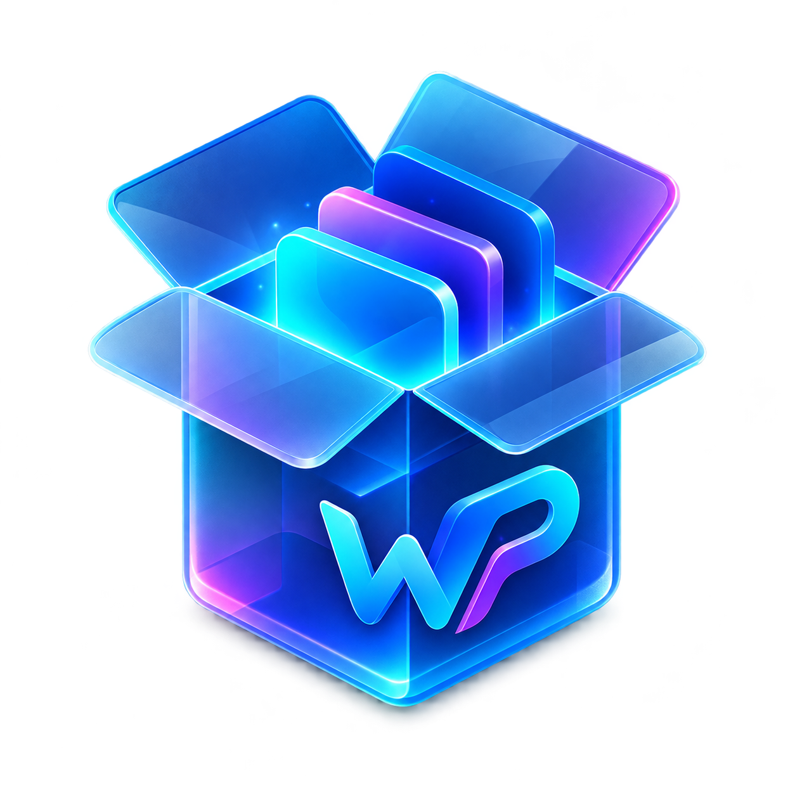
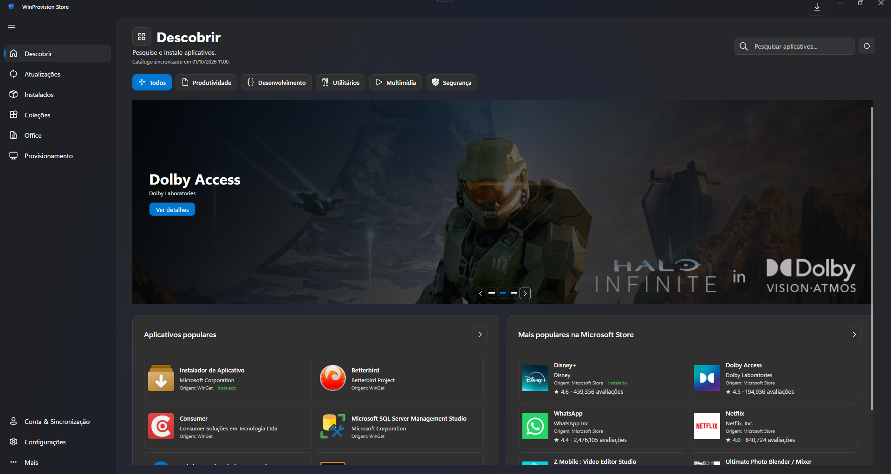

<p align="center">
  
</p>

<h1 align="center">WinProvision Store</h1>

<p align="center">
  Encontre aplicativos, mantenha o Windows atualizado e prepare uma instalação personalizada em um só lugar.
</p>

<p align="center">
  <a href="https://github.com/GabrielSilvaTI/WinProvision-Store/releases/latest"></a>
  <a href="https://github.com/GabrielSilvaTI/WinProvision-Store/releases"></a>
  
  
</p>

<p align="center">
  <a href="#visao-geral">Visão geral</a> ·
  <a href="#recursos">Recursos</a> ·
  <a href="#instalação">Instalação</a> ·
  <a href="#compilar">Compilar</a> ·
  <a href="#privacidade-e-segurança">Privacidade e segurança</a>
</p>

## Visão geral

O **WinProvision Store** é um aplicativo para Windows que reúne descoberta e instalação de programas, gerenciamento de atualizações e ferramentas para configurar o computador. Ele combina entradas do **WinGet** e da **Microsoft Store** em uma interface única, com pesquisa, filtros e informações sobre cada pacote.

O projeto também ajuda a preparar computadores novos ou reinstalados: monte um perfil com aplicativos e preferências do Windows, exporte o JSON e aplique-o depois pelo **WinProvision Orchestrator**.

<p align="center">
  
</p>

<p align="center"><sub>Demonstração do WinProvision Store</sub></p>

### Captura de tela

<p align="center">
  
</p>

## Recursos

### Descobrir e instalar aplicativos

- Pesquise no catálogo por nome ou identificador do pacote.
- Explore categorias como produtividade, desenvolvimento, utilitários, multimídia e segurança.
- Filtre e classifique resultados, incluindo por origem — WinGet ou Microsoft Store.
- Consulte os detalhes disponíveis, como editor, descrição e mídias do aplicativo.
- Instale um ou mais aplicativos e acompanhe as operações na fila do app.

### Atualizações e aplicativos instalados

- Verifique atualizações de pacotes compatíveis com as fontes configuradas no Windows.
- Selecione atualizações e acompanhe o andamento das operações.
- Opcionalmente, configure a execução de atualizações em segundo plano ao iniciar sua sessão do Windows.
- Consulte os aplicativos instalados, pesquise, filtre e use as opções de gerenciamento disponíveis para cada pacote.

### Coleções e perfis

- Organize aplicativos em coleções para reutilizar seleções.
- Exporte e importe perfis de provisionamento em JSON.
- Faça backup local dos perfis; os recursos de sincronização na nuvem dependem da configuração e da conta conectada no app.

### Office

Configure uma instalação do Microsoft 365 ou Office compatível com a ferramenta de implantação da Microsoft:

- escolha os aplicativos da suíte, arquitetura, idioma e canal;
- inclua opções compatíveis, como Visio ou Project;
- revise a configuração XML antes de iniciar;
- use as operações disponíveis para instalar, atualizar, reparar ou remover produtos detectados.

A instalação e a ativação continuam sujeitas à licença e à conta Microsoft do usuário.

### Provisionamento do Windows

Selecione preferências para aplicar ao computador, incluindo:

- tema do Windows e dos aplicativos, cor de destaque e papel de parede;
- opções compatíveis da barra de tarefas;
- nome do computador e informações OEM;
- data, hora e fuso horário automáticos;
- plano de energia, suspensão e desligamento da tela;
- preferências do Explorador de Arquivos;
- análise e limpeza cuidadosa de arquivos temporários, ignorando itens em uso e links para outros locais.

A pré-visualização da área de trabalho é ilustrativa. As opções disponíveis podem depender da edição do Windows, permissões e políticas configuradas no dispositivo.

### WinProvision Orchestrator

O Orchestrator aplica um perfil JSON em uma execução guiada. Ele pode instalar os pacotes e aplicar as configurações selecionadas, com acompanhamento do progresso e registro da execução.

- Use a interface visual ou o modo de terminal, conforme o fluxo iniciado.
- Consulte logs locais ou acompanhe a execução pelo recurso de logs na nuvem, quando configurado.
- Use o QR Code exibido para abrir o acompanhamento da execução em outro dispositivo.
- Gere um bootstrap para baixar e iniciar o processo automatizado a partir de um perfil conectado.

### Histórico, diagnóstico e configurações

- Consulte operações concluídas e registros de diagnóstico.
- Ajuste preferências do aplicativo e opções de inicialização.
- Conecte uma conta quando quiser usar os recursos de backup/sincronização que exigem autenticação.

## Instalação

Baixe a versão mais recente na página de [Releases](https://github.com/GabrielSilvaTI/WinProvision-Store/releases/latest). Escolha o pacote correspondente à arquitetura do seu Windows e siga as instruções incluídas na publicação.

O catálogo, algumas imagens e operações online precisam de conexão com a internet. A instalação de pacotes também depende da disponibilidade da fonte correspondente no Windows.

## Compilar

O projeto usa **WPF**, **.NET 10** e **WPF-UI 4.3.0**. Para compilar no Windows:

1. Instale o .NET 10 SDK e o Visual Studio com a carga de trabalho **Desenvolvimento para desktop com .NET**.
2. Clone o repositório e abra `WinProvisionStore.sln`.
3. Restaure os pacotes NuGet e compile a solução em `Release`.

Também é possível compilar pelo terminal na raiz do repositório:

```powershell
dotnet build .\WinProvisionStore.sln --configuration Release
```

## Privacidade e segurança

- O WinProvision Store executa operações locais de instalação e configuração que podem exigir permissões de administrador.
- Revise as opções e o perfil antes de aplicá-los, especialmente em implantações automatizadas.
- Logs na nuvem, sincronização e downloads de catálogos dependem dos serviços remotos configurados pelo projeto.
- Não inclua tokens, senhas ou outros segredos em perfis JSON, comandos de bootstrap ou arquivos compartilhados.
- Pacotes de terceiros permanecem sujeitos às licenças e condições de seus respectivos editores.

## Contribuições e problemas

Sugestões, relatos de bugs e contribuições são bem-vindos. Antes de abrir uma issue, confira se já existe um relato sobre o mesmo problema. Ao reportar uma falha, inclua a versão do app, a edição do Windows e os passos para reproduzi-la; remova dados pessoais e tokens dos logs.

- [Abrir uma issue](https://github.com/GabrielSilvaTI/WinProvision-Store/issues)
- [Ver versões e downloads](https://github.com/GabrielSilvaTI/WinProvision-Store/releases)

## Desenvolvimento assistido por inteligência artificial

O WinProvision Store foi desenvolvido com auxílio de ferramentas de inteligência artificial em atividades de implementação, análise, documentação e revisão. A IA apoiou o trabalho; as decisões sobre o produto, a integração e a validação permanecem sob responsabilidade do mantenedor do projeto.

## Licenças

Consulte os arquivos de licença e avisos de terceiros incluídos no repositório. O WinProvision Store integra ferramentas, catálogos, imagens e pacotes mantidos por terceiros; suas marcas e condições de uso pertencem aos respectivos titulares.
